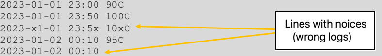

# CelsiaLog

[](https://github.com/jaroslawroszyk/CelsiaLog/actions/workflows/build.yml)
[](https://www.repostatus.org/#wip)
[](#license)
## CelsiaLog whats mean?
comes from the name of the temperature unit (degrees Celsius), which is related to the main element of log analysis - temperature measurements.

# Setup project:
* `pip install -r requirements.txt`

### (Optional) Create a Python environment: 
* For Python3 users: 
  * `pip install virtualenv`
  * `virtualenv venv_name`
  * `source path/to/venv_name activate`


# Documentation:
## Description

As a new programmer at an automotive company, you were tasked with writing a program to automatically analyze the logs of an experimental electric motor. In the log in the form of a text file, the sensor saves the temperature measurements inside the engine, each measurement is on a separate line.

## Input data:

### Description

An input file containing lines, where each line contains the following data:

- Date and time in the format **YYYY-MM-DD HH:MM**
	-  Example: 2023-01-01 00:00
- Temperature measurement in **XC** format
	- Examples: 10C, 10.3C
	- X can be a non-negative integer or a floating point number

These data in the line are separated by a single space character.

The above guidelines must be **strictly** followed by lines in the input file

## Example of input file content:

```
2023-01-01 23:00 90C  
2023-01-01 23:50 100C  
2023-01-02 00:10 95C
```

This motor generates a strong electromagnetic (EM) field that can interfere with the sensor. If there is any interference in the line with the input data (e.g. some data does not comply with the specified format, date/time is incorrect, any of the data is missing, the temperature is negative, etc.) causing the above data guidelines not to be met, then the given line is considered a faulty log.

## Example of input file content with noise:



## Standard range of parameters

The normal operating temperature range for this engine is **0 to 100 degrees inclusive** and the acceptable noise level (percentage of bad logs) is **0 to 10 percent inclusive**.

# Structural requirements

This program should have a function or method called **generate_report** in the main module, which takes one argument which is the path to the input file with logs. This function/method should return a dictionary with a report, described later in the "Output data" chapter.

# Output
## Description

The function/method **generate_report** returns a dictionary with the following format (example with given random values):

```json
{
    "faulty_logs": [
        "2023--1-1 -10C"
    ],
    "percentage_of_faulty_logs": "100.0",
    "report_duration": 10,
    "temperature": {
        "max": "20.0",
        "min": "2.0",
        "avg": "11.0"
    },
    "longest_overheating_time": 0,
    "number_of_overheat_periods": 0,
    "problems": {
        "high level of EM interference": False,
        "high risk of engine damage due to temperature": False
    }
}
```

## Description of individual fields:

- **faulty_logs**
	- A list containing all lines from the log file that are affected
	- The items in this list are in the same order as they appear in the input file.
	- The default value is an empty list.

- **percent_of_faulty_logs**
	- A text value representing a floating point number with one decimal place, e.g. "30.5".
	- Shows what percentage of all lines in the file are lines with noise.
	- The default value is "100.0".

- **report_duration**
	- Based only on valid lines (no glitches).
	- Value given as an integer, e.g. 54
	- Specifies how much time (in minutes) the given input file covers.
	- In the case of only one valid line or no valid lines, the value 0 should be given.

- **temperature**
	- Dictionary with keys **max**, **min**, **average**
	- **max** field in the **temperature** dictionary:
		- Based only on valid lines (no glitches).
		- A text value representing a floating point number with one decimal place, e.g. "20.0".
		- Specifies what was the highest recorded temperature in a given file.
		- Default value is **None.**
	- Field **min** in the dictionary:
		- Based only on valid lines (no glitches).
		- A text value representing a floating point number with one decimal place, e.g. "2.0".
		- Specifies what was the lowest recorded temperature in a given file.
		- Default value is **None.**
	- The **average** field in the **temperature** dictionary:
		- Based only on valid lines (no glitches).
		- A text value representing a floating point number with one decimal place, e.g. "11.5".
		- Determines the arithmetic mean of the recorded temperatures in a given file.
		- Default value is **None.**

- **longest_overheating_time**
	- Based only on valid lines (no glitches).
	- Value given as an integer, e.g. 30.
	- Specifies the longest period of time (in minutes) during which the temperature was greater than 100 degrees.
	- The overheat section ends when there is a reading with a temperature less than or equal to 100 degrees, or when valid lines in the file end.
	- The default value is 0.

- **number_of_overheating_periods**
	- Based only on valid lines (no glitches).
	- Value given as an integer, e.g. 2.
	- Specifies the number of periods when the recorded temperature was above 100 degrees.
	- The default value is 0.

## Problems:
1. Glossary with keys **high_level_EM_interference**, **high_risk_of_engine_damage_due to_temperature**
	1. Field **high_level_EM_interference** in the **issues** dictionary:
		- **bool** value
		- If the percentage of defective logs in the file is greater than 10, this field takes the value **True**
		- Default **False**
	2. Field **high_risk_of_engine_damage_due to_temperature** in the **issues** dictionary:
		- **bool** value
		- If the engine was overheated (temperature over 100 degrees) for more than 10 minutes, this field takes the value **True**
		- Default **False**

# Examples

## Example 1
**Input file content**:
```
2023-01-01 23:00 90C
2023-01-01 23:50 100C
2023-01-02 00:10 95C
```
**Output**:
```json
{
    "faulty_logs": [],
    "percentage_of_faulty_logs": "0.0",
    "report_duration": 70,
    "temperature": {
        "max": "100.0",
        "min": "90.0",
        "avg": "95.0"
    },
    "longest_overheating_time": 0,
    "number_of_overheat_periods": 0,
    "problems": {
        "high level of EM interference": False,
        "high risk of engine damage due to temperature": False
    }
}
```

## Example 2
**Input file content**:
```
2023-01-01 23:00 90C  
2023-01-01 23:50 100C  
2023-x1-01 23:5x 10xC  
2023-01-02 00:10 95C  
2023-01-02 00:10
```
**Output**:
```json
{
    "faulty_logs": [
        "2023-x1-01 23:5x 10xC",
        "2023-01-02 00:10"
    ],
    "percentage_of_faulty_logs": "40.0",
    "report_duration": 70,
    "temperature": {
        "max": "100.0",
        "min": "90.0",
        "avg": "95.0"
    },
    "longest_overheating_time": 0,
    "number_of_overheat_periods": 0,
    "problems": {
        "high level of EM interference": True,
        "high risk of engine damage due to temperature": False
    }
}
```

## Example 3
**Input file content**:
```
2023-01-01 23:00 90C  
2023-01-01 23:50 110C  
2023-x1-01 23:5x 10xC  
2023-01-02 00:10 95C  
2023-01-02 00:15 -78C  
2023-01-02 00:20 100.3C  
2023-01-02 00:40 115.3C  
2023-01-02 00:50 100.1C  
2023-01-02 01:00 106C  
2023-01-02 01:10
```
**Output**:
```json
{
    "faulty_logs": [
        "2023-x1-01 23:5x 10xC",
        "2023-01-02 00:15 -78C",
        "2023-01-02 01:10"
    ],
    "percentage_of_faulty_logs": "30.0",
    "report_duration": 120,
    "temperature": {
        "max": "115.3",
        "min": "90.0",
        "avg": "102.4"
    },
    "longest_overheating_time": 40,
    "number_of_overheat_periods": 2,
    "problems": {
        "high level of EM interference": True,
        "high risk of engine damage due to temperature": True
    }
}
```