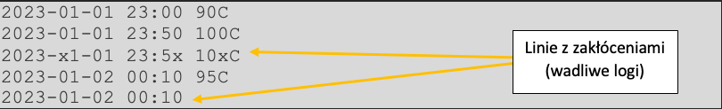

# Wstęp

Jako nowy programista w pewnej firmie motoryzacyjnej dostałeś za zadanie napisać program do automatycznej analizy logów eksperymentalnego silnika elektrycznego. W dzienniku w postaci pliku tekstowego, czujnik zapisuje pomiary temperatury wewnątrz silnika, każdy pomiar jest w oddzielnej linii.

# Dane wejściowe

## Opis

Plik wejściowy zawierający linie, gdzie każda linia zawiera następujące dane:

- Data i czas w formacie **YYYY-MM-DD HH:MM**
	 - Przykład: 2023-01-01 00:00
- Pomiar temperatury w formacie **XC**
	- Przykłady: 10C, 10.3C
	- X może być nieujemną liczbą całkowitą albo zmiennoprzecinkową

Dane te w linii są oddzielone przy pomocy pojedynczego znaku spacji.

Powyższe wytyczne muszą być **ściśle** przestrzegane przez linie w pliku wejściowym

## Przykład zawartości pliku wejściowego:

```
2023-01-01 23:00 90C  
2023-01-01 23:50 100C  
2023-01-02 00:10 95C
```

Silnik ten generuje mocne pole elektromagnetyczne (EM), które może powodować zakłócenia w pracy czujnika. Jeśli w linii z danymi wejściowymi występuje jakiekolwiek zakłócenie (np. któraś dana jest niezgodna z określonym formatem, data/czas są niepoprawne, brakuje którejś z danych, temperatura jest ujemna, itp.) powodujące, że powyższe wytyczne do danych nie są spełnione, to dana linia uznawana jest za wadliwy log.

## Przykład zawartości pliku wejściowego z zakłóceniami:


## Standardowy zakres parametrów

Zakres normalnej temperatury pracy tego silnika to **0 do 100 stopni włącznie**, a akceptowalny poziom zakłóceń (procentowy poziom wadliwych logów) to **0 do 10 procent włącznie**.

# Wymagania strukturalne

Program ten powinien posiadać w głównym module funkcję lub metodę o nazwie **generuj_raport**, która przyjmuje jeden argument będący ścieżką do pliku wejściowego z logami. Funkcja/metoda ta powinna zwracać słownik z raportem, opisany dalej w rozdziale „Dane wyjściowe”.

# Dane wyjściowe
## Opis

Funkcja/metoda **generuj_raport** zwraca słownik o następującym formacie (przykład z podanymi losowymi wartościami):
```json
{
  "wadliwe_logi": [
    "2023--1-1 -10C"
  ],
  "procent_wadliwych_logow": "100.0",
  "czas_trwania_raportu": 10,
  "temperatura": {
    "max": "20.0",
    "min": "2.0",
    "srednia": "11.0"
  },
  "najdluzszy_czas_przegrzania": 0,
  "liczba_okresow_przegrzania": 0,
  "problemy": {
    "wysoki poziom zaklocen EM": False,
    "wysokie ryzyko uszkodzenia silnika z powodu temperatury": False
  }  
}
```

## Opis poszczególnych pól:

- **wadliwe_logi**
	- Lista zawierająca wszystkie linie z pliku z logami, w których występują zakłócenia
	-  Pozycje w tej liście znajdują się w tej samej kolejności w jakiej występują w pliku wejściowym.
	- Domyślna wartość to pusta lista.

- **procent_wadliwych_logow**
	- Wartość tekstowa przedstawiająca liczbę zmiennoprzecinkową z jednym miejscem po przecinku, np. "30.5".
	- Przedstawia jaki procent wszystkich linii w pliku stanowią linie z zakłóceniami.
	- Domyślna wartość to "100.0".

- **czas_trwania_raportu**
	- Bazuje tylko na poprawnych liniach (bez zakłóceń).
	- Wartość podawana jako liczba całkowita, np. 54
	- Określa ile czasu (w minutach) obejmuje dany plik wejściowy.
	- W przypadku tylko jednej poprawnej linii lub braku poprawnych linii powinna być podana wartość 0.
	
- **temperatura**
	- Słownik z kluczami **max**, **min**, **srednia**
	- Pole **max** w słowniku **temperatura**:
		- Bazuje tylko na poprawnych liniach (bez zakłóceń).
		- Wartość tekstowa przedstawiająca liczbę zmiennoprzecinkową z jednym miejscem po przecinku, np. "20.0".
		- Określa jaka była największa zanotowana temperatura w danym pliku.
		- Domyślna wartość to **None.**
	- Pole **min** w słowniku:
		- Bazuje tylko na poprawnych liniach (bez zakłóceń).
		- Wartość tekstowa przedstawiająca liczbę zmiennoprzecinkową z jednym miejscem po przecinku, np. "2.0".
		- Określa jaka była najmniejsza zanotowana temperatura w danym pliku.
		- Domyślna wartość to **None.**
	- Pole **srednia** w słowniku **temperatura**:
		- Bazuje tylko na poprawnych liniach (bez zakłóceń).
		- Wartość tekstowa przedstawiająca liczbę zmiennoprzecinkową z jednym miejscem po przecinku, np. "11.5".
		- Określa średnią arytmetyczną z zanotowanych temperatur w danym pliku.
		- Domyślna wartość to **None.**

- **najdluzszy_czas_przegrzania**
	- Bazuje tylko na poprawnych liniach (bez zakłóceń).
	- Wartość podawana jako liczba całkowita, np. 30.
	- Określa najdłuższy odcinek czasu (w minutach), w którym temperatura była większa niż 100 stopni.
	- Odcinek przegrzania kończy się w momencie gdy występuje odczyt z temperaturą mniejszą lub równą 100 stopni, albo gdy kończą się poprawne linie w pliku.
	- Domyślna wartość to 0.
- **liczba_okresow_przegrzania**
	- Bazuje tylko na poprawnych liniach (bez zakłóceń).
	- Wartość podawana jako liczba całkowita, np. 2.
	- Określa liczbę okresów gdy zanotowana temperatura była powyżej 100 stopni.
	- Domyślna wartość to 0.

- Problemy:
	1. Słownik z kluczami **wysoki_poziom_zaklocen_EM**, **wysokie_ryzyko_uszkodzenia_silnika_z_powodu_temperatury**
		1. Pole **wysoki_poziom_zaklocen_EM** w słowniku **problemy**:
			- Wartość typu **bool**
			- Jeśli udział procentowy wadliwych logów w pliku jest większy od 10 to pole to przyjmuje wartość **True**
			- Domyślnie **False**
		2. Pole **wysokie_ryzyko_uszkodzenia_silnika_z_powodu_temperatury** w słowniku **problemy**:
			-  Wartość typu **bool**
			- Jeśli silnik był przegrzany (temperatura ponad 100 stopni) przez ponad 10 minut to pole to przyjmuje wartość **True**
			- Domyślnie **False**


# Przykłady

## Przykład 1
**Zawartość pliku wejściowego**:
```
2023-01-01 23:00 90C  
2023-01-01 23:50 100C  
2023-01-02 00:10 95C
```
**Dane wyjściowe**:
```json
{
  "wadliwe_logi": [],
  "procent_wadliwych_logow": "0.0",
  "czas_trwania_raportu": 70,
  "temperatura": {
    "max": "100.0",
    "min": "90.0",
    "srednia": "95.0"
  },
  "najdluzszy_czas_przegrzania": 0,
  "liczba_okresow_przegrzania": 0,
  "problemy": {
    "wysoki_poziom_zaklocen_EM": False,
    "wysokie_ryzyko_uszkodzenia_silnika_z_powodu_temperatury": False
  }
}

```

## Przykład 2

**Zawartość pliku wejściowego**:

```
2023-01-01 23:00 90C  
2023-01-01 23:50 100C  
2023-x1-01 23:5x 10xC  
2023-01-02 00:10 95C  
2023-01-02 00:10
```
**Dane wyjściowe**:
```json
{
  "wadliwe_logi": [
    "2023-x1-01 23:5x 10xC",
    "2023-01-02 00:10"
  ],
  "procent_wadliwych_logow": "40.0",
  "czas_trwania_raportu": 70,
  "temperatura": {
    "max": "100.0",
    "min": "90.0",
    "srednia": "95.0"
  },
  "najdluzszy_czas_przegrzania": 0,
  "liczba_okresow_przegrzania": 0,
  "problemy": {
    "wysoki_poziom_zaklocen_EM": True,
    "wysokie_ryzyko_uszkodzenia_silnika_z_powodu_temperatury": False
  }
}
```

## Przykład 3

**Zawartość pliku wejściowego**

```
2023-01-01 23:00 90C  
2023-01-01 23:50 110C  
2023-x1-01 23:5x 10xC  
2023-01-02 00:10 95C  
2023-01-02 00:15 -78C  
2023-01-02 00:20 100.3C  
2023-01-02 00:40 115.3C  
2023-01-02 00:50 100.1C  
2023-01-02 01:00 106C  
2023-01-02 01:10
```
**Dane wyjściowe**:
```json
{
  "wadliwe_logi": [
    "2023-x1-01 23:5x 10xC",
    "2023-01-02 00:15 -78C",
    "2023-01-02 01:10"
  ],
  "procent_wadliwych_logow": "30.0",
  "czas_trwania_raportu": 120,
  "temperatura": {
    "max": "115.3",
    "min": "90.0",
    "srednia": "102.4"
  },
  "najdluzszy_czas_przegrzania": 40,
  "liczba_okresow_przegrzania": 2,
  "problemy": {
    "wysoki_poziom_zaklocen_EM": True,
    "wysokie_ryzyko_uszkodzenia_silnika_z_powodu_temperatury": True
  }
}
```